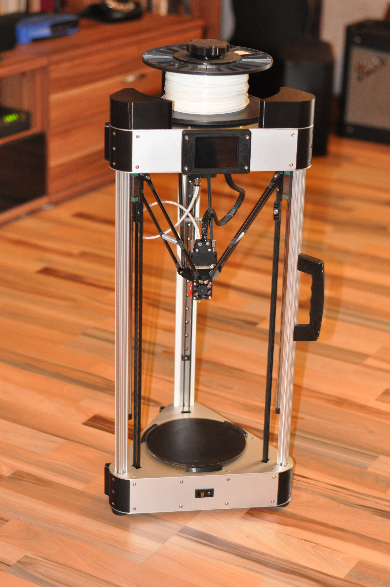
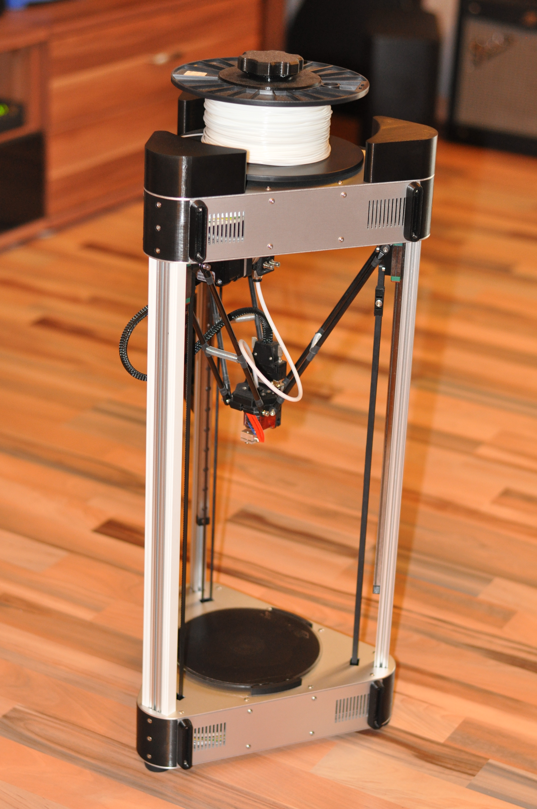
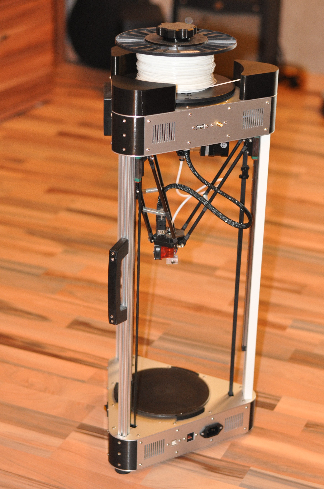

# Layer Cake

Delta robot 3D printer based on the [Kossel Mini](https://github.com/jcrocholl/kossel) by Johann C. Rocholl.

## Project State

**Prototype** - Some parts are still missing or under heavy development. The printer is already printing its own parts.

### Software

All parts have been designed in FreeCAD.  
The repository contains a FreeCAD file and an stl for each part.

## Project Goals

- [x] Fit all electronics in the printer enclosure.
- [ ] Integrate a raspberry pi and touchscreen for running octoprint.
- [x] Make the effector easily swappable.
- [x] Integrated belt tensioning system.
